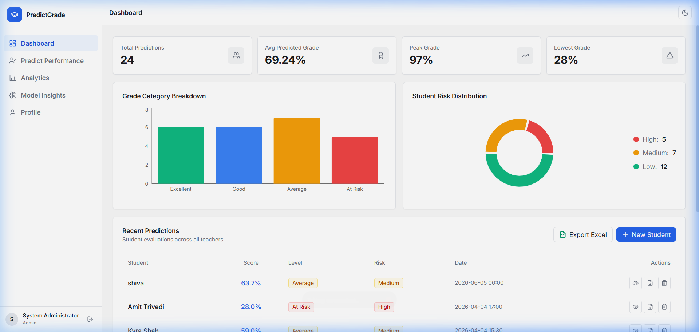
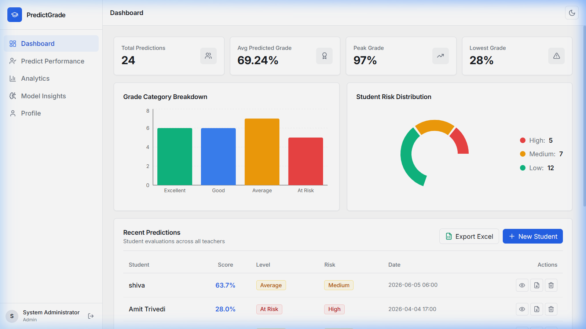
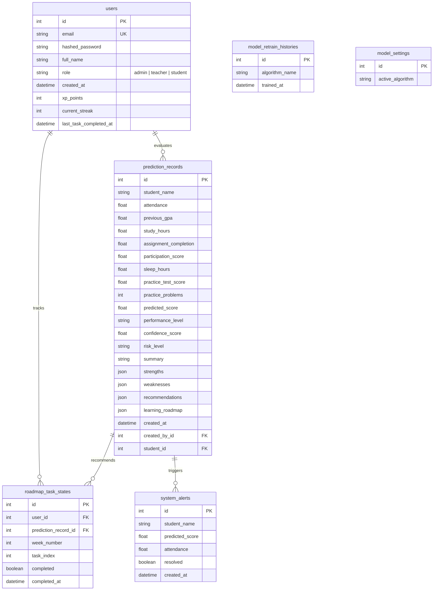

# 🎓 PredictGrade: Student Performance Analytics & Prediction Portal

PredictGrade is a production-grade web portal built to analyze academic progress, predict terminal exam performance using regression models, isolate study habit inefficiencies, and generate personalized study roadmaps.

🚀 **[Live Production Demo](https://student-performance-prediction-liard.vercel.app/)**

---

## 📸 Screenshots & Live Preview

### Dashboard Overview


### Sign In Screen


---

## 📐 Mathematical Framework & Inference Logic

### 1. Grade Prediction Estimation
Expected exam score ($Y_{pred}$) is estimated using one of the selected regressor candidates trained on student feature matrices:
* **Linear Regression / Ridge Regressor**: Estimates via a weighted combination of academic and habit coefficients.
* **Random Forest / Gradient Boosting**: Employs non-linear tree splits to evaluate interaction thresholds.
* **MLP Neural Network**: Fits a multi-layer perceptron topology utilizing backpropagation.

$$Y_{pred} = f(X_{attendance}, X_{gpa}, X_{study\_hours}, X_{problems}, X_{sleep}, X_{assignments}, X_{participation}, X_{test\_score})$$

### 2. Estimation Confidence Metric
The portal calculates a confidence rating ($C$) mapping how close the inputs lie to the historical training distribution centroid. It evaluates the scaled Euclidean Z-score distance ($z$) in multi-dimensional space, discounting confidence as outliers deviate:

$$Confidence = R^2 \times e^{-\lambda z} \times 100$$

*Where:*
* $R^2$: The coefficient of determination of the active ML algorithm (e.g. $0.84$).
* $z$: The Mahalanobis/Euclidean Z-score distance from the feature centroid.
* $\lambda$: Exponential decay rate parameter (calibrated at $0.15$).

### 3. Risk Level Classification
Academic risk is segmented into three tiers:
* 🔴 **High Risk**: Predicted Final Grade $< 60\%$ OR Attendance Rate $< 75\%$.
* 🟡 **Medium Risk**: Predicted Final Grade $\ge 60\%$ and $< 75\%$, with Attendance Rate $\ge 75\%$.
* 🟢 **Low Risk**: Predicted Final Grade $\ge 75\%$ and Attendance Rate $\ge 85\%$.

---

## 📊 Evaluation Feature Definition

Predictions ingest 8 primary features across two categories:

| Feature Column | Description | Range / Domain | Weight Impact |
| :--- | :--- | :---: | :---: |
| **`attendance`** | Ratio of lectures attended by the student | `0.0%` - `100.0%` | High |
| **`previous_gpa`** | Cumulative GPA prior to the current course term | `0.0` - `10.0` | High |
| **`study_hours`** | Self-reported weekly study allocation | `0.0` - `40.0` hrs | Medium |
| **`assignment_completion`** | Percentage of coursework assignments submitted | `0.0%` - `100.0%` | Medium |
| **`participation_score`** | Class interactive engagement score graded by instructor | `0.0` - `10.0` | Low |
| **`sleep_hours`** | Average hours of nightly rest | `0.0` - `12.0` hrs | Low |
| **`practice_test_score`** | Score obtained in mock examinations | `0.0%` - `100.0%` | High |
| **`practice_problems`** | Count of supplementary problems solved | `0` - `200` | Medium |

---

## 🗄️ Database Schema Blueprint

The SQLite/PostgreSQL relational database contains 6 key tables:



---

## 🔌 API Endpoint Specifications

All data routes are prefixed with `/api` and secured under Bearer JWT authorization headers.

### Authentication Router (`/api/auth`)
* `POST /register`: Registers a new account. Returns a user profile payload.
* `POST /login`: Receives `username` and `password` as url-encoded form data. Returns a JWT access token `{"access_token": "...", "token_type": "bearer"}`.
* `GET /me`: Returns the current authenticated user's profile and gamification stats.
* `PUT /profile`: Modifies `full_name`, `email`, or `password` settings.

### Predictions Router (`/api/predict`)
* `POST /predict`: Receives student features. Evaluates prediction metrics and AI roadmap blocks. Returns the record. (Teacher/Admin only)
* `GET /history`: Returns a list of past evaluations. Students are isolated to their own records; Teachers/Admins can view all records.
* `GET /record/{id}`: Fetches details of a single report card.
* `DELETE /record/{id}`: Deletes an evaluation record. (Teacher/Admin only)
* `GET /export/pdf/{id}`: Streams a dynamic Report PDF download.
* `GET /export/excel`: Streams history spreadsheet exports. (Teacher/Admin only)
* `GET /roadmap/tasks`: Returns study plan milestones checklist.
* `PUT /roadmap/tasks`: Toggles roadmap checkmark state, calculating and awarding XP and Streaks.
* `POST /chat`: Integrates AI study assistant inquiries.
* `POST /bulk`: Evaluates multi-student batches from a CSV upload. (Teacher/Admin only)

### System Alerts Router (`/api/alerts`)
* `GET /`: Returns a list of unresolved high-risk warning alerts. (Teacher/Admin only)
* `POST /{alert_id}/resolve`: Resolves an alert. (Teacher/Admin only)
* `POST /email`: Dispatches an evaluation PDF report to parents or advisors. (Teacher/Admin only)

### Model Management Router (`/api/model`)
* `GET /info`: Fetches active regressor scores, features, and relative importances.
* `POST /retrain`: Triggers retraining pipeline. (Admin only)
* `POST /active`: Configures the active pipeline algorithm dynamically. (Admin only)
* `POST /clear-data`: Purges prediction history records. (Admin only)
* `POST /seed-data`: Resets prediction seeder data. (Admin only)

---

## 🔑 Default Credentials

The seeder initializes default accounts for testing the role-based access privileges:

| Role | Username | Password | Access Privileges |
| :--- | :--- | :--- | :--- |
| **Admin** | `admin@example.com` | `admin123` | Active ML controls, pipeline retraining, database seeder, teacher features |
| **Teacher** | `teacher@example.com` | `teacher123` | Manual & bulk predictions, analytics graphs, alerts dropdown, parent dispatcher |
| **Student** | `student@example.com` | `student123` | Gamified stats (Level/XP/Streaks), Kanban checklist, AI study chat companion |

---

## 🚀 How to Run the Project (Step-by-Step)

### Option 1: Quick Local Run (Manual Setup)

Ensure you have **Python 3.10+** and **Node.js 18+** installed.

#### Step 1: Set Up & Start Backend
1. Open your terminal and navigate to the project root folder:
   ```bash
   cd Student_Performance_Prediction
   ```
2. Create and activate a python virtual environment:
   ```bash
   # Windows:
   python -m venv venv
   .\venv\Scripts\activate
   
   # macOS/Linux:
   python3 -m venv venv
   source venv/bin/activate
   ```
3. Install the required python dependencies:
   ```bash
   pip install -r backend/requirements.txt
   ```
4. Start the backend server using Uvicorn:
   ```bash
   python -m uvicorn backend.app.main:app --host 127.0.0.1 --port 8000 --reload
   ```
   *The Swagger UI documentation is now accessible at [http://127.0.0.1:8000/docs](http://127.0.0.1:8000/docs).*

#### Step 2: Set Up & Start Frontend
1. Open a new, separate terminal window and navigate to the `frontend/` directory:
   ```bash
   cd Student_Performance_Prediction/frontend
   ```
2. Install the node package dependencies:
   ```bash
   npm install
   ```
3. Start the Vite React development server:
   ```bash
   npm run dev
   ```
4. Open your web browser and navigate to **[http://localhost:5173](http://localhost:5173)** (or the port shown in your terminal).

---

### Option 2: Running with Docker (Recommended)

Orchestrate the entire platform in a single command using Docker Compose:

1. Ensure **Docker Desktop** is running on your machine.
2. In the project root directory, run:
   ```bash
   docker-compose up --build
   ```
3. Once the containers build and boot:
   * **Frontend Application**: Navigate to **[http://localhost](http://localhost)**.
   * **FastAPI Backend Swagger**: Navigate to **[http://localhost:8000/docs](http://localhost:8000/docs)**.
